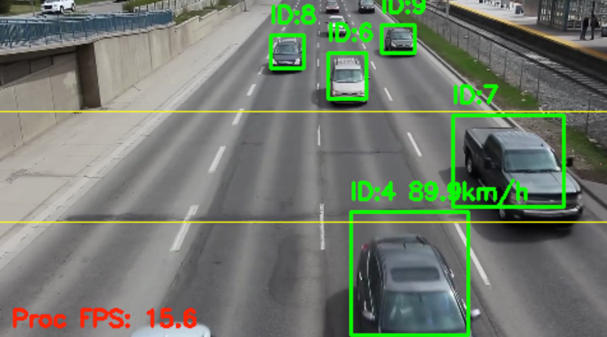
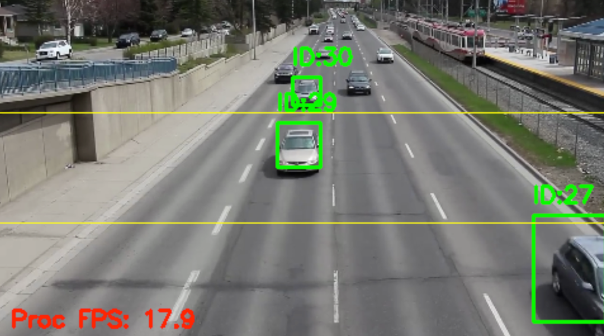

# Real-Time Vehicle Speed Estimation using YOLOv8 and Norfair
This project presents a real-time system for estimating the speed of vehicles from video footage. It leverages the state-of-the-art object detection model YOLOv8 for identifying vehicles and the lightweight tracking library Norfair for tracking their movements across frames. The speed is calculated by measuring the time it takes for a tracked object to cross two predefined virtual lines.


# Demo




# 📖 Full Technical Report
For a detailed explanation of the methodology, system architecture, performance evaluation, and results, please refer to the full project report.

➡️ [Read the Full Technical Report (Project_Report.pdf)``Persian File``](Project_Report.pdf)


# ✨ Key Features

* Real-time Vehicle Detection: Utilizes the highly accurate and efficient YOLOv8n model.

* Robust Object Tracking: Implements Norfair for lightweight and reliable multi-object tracking.

* Speed Estimation: Calculates vehicle speed in km/h based on crossing virtual "tripwires".

* Multi-Class Support: Capable of detecting and tracking various vehicle types (cars, trucks, buses, motorcycles).

* Optimized Performance: Employs threading for I/O operations (frame reading) to prevent blocking the main processing loop.

* Highly Configurable: Key parameters like model paths, confidence thresholds, and calibration distances are easily adjustable.


# ⚙️ How It Works

The system operates through a sequential pipeline for each frame of the video stream:

1. **Frame Capture:** A dedicated thread reads frames from the video source and places them in a queue to ensure smooth processing without I/O bottlenecks.

2. **Object Detection:** The YOLOv8 model processes each frame to detect vehicles. It filters detections based on a confidence threshold and predefined classes of interest.

3. **Object Tracking:** The detected bounding boxes are passed to the Norfair tracker. Norfair uses a Kalman filter and a distance function to assign a unique ID to each vehicle and track its trajectory across consecutive frames.

4. **Speed Calculation:**

   * Two horizontal lines are defined at fixed positions in the frame.

   * When a tracked object crosses the first line, its entry frame number is recorded.

   * When the same object crosses the second line, the exit frame number is recorded.

   * The time elapsed is calculated based on the frame rate (``time = Δframes / fps``).

   * Speed is then computed using a pre-calibrated real-world distance between the two lines (``speed = distance / time``).

5. **Visualization:** The processed frame is annotated with bounding boxes, track IDs, and the calculated speed for each vehicle. The virtual lines and processing FPS are also displayed.


# 🛠️ Tech Stack & Libraries

* **Python 3.9+**

* **PyTorch:** For running the YOLOv8 model.

* **Ultralytics (``YOLOv8``):** For object detection.

* **Norfair:** For object tracking.

* **OpenCV-Python:** For video processing and visualization.

* **NumPy:** For numerical operations.


# 🚀 Setup and Installation

Follow these steps to set up the project environment.

**1. Clone the repository:**
```bash
git clone https://github.com/Mahdi-Soleimani/Vehicle-speed-estimation.git
cd Vehicle-speed-estimation
```

**2. Create a virtual environment:**
```bash
python -m venv venv
# On Windows
venv\Scripts\activate
# On macOS/Linux
source venv/bin/activate
```


**3. Install the required dependencies:**
```bash
pip install -r requirements.txt
```
Your ``requirements.txt`` file should contain:
```text
torch
ultralytics
norfair
opencv-python
numpy
```

**4. Download Resources:**

* The YOLOv8 model (``yolov8n.pt``) will be downloaded automatically by the ``ultralytics`` library on the first run.

* Place your input video file (e.g., ``f.mp4``) in the root directory of the project, or update the ``VIDEO_PATH`` variable in the script.


# ▶️ Usage

To run the speed estimation system, execute the main script from the terminal:
```bash
python main_tracker.py
```
Press the ``ESC`` key to stop the program.


# 🔧 Configuration

You can modify the behavior of the script by adjusting the constants at the top of the ``main_tracker.py`` file:

* ``VIDEO_PATH``: Path to the input video file.

* ``YOLO_MODEL_PATH``: Path to the YOLOv8 model weights.

* ``CONF_THRESHOLD``: Confidence score threshold for object detection.

* ``ALLOWED_CLASSES``: List of COCO class IDs to be detected (e.g., 2 for car, 7 for truck).

* ``CALIBRATED_DISTANCE``: The real-world distance (in meters) between the two virtual lines. This is critical for accurate speed calculation.

* ``line1_y`` & ``line2_y``: The vertical positions of the speed-measuring lines.


# 📜 License

This project is licensed under the MIT License. See the [LICENSE](LICENSE) file for more details.
